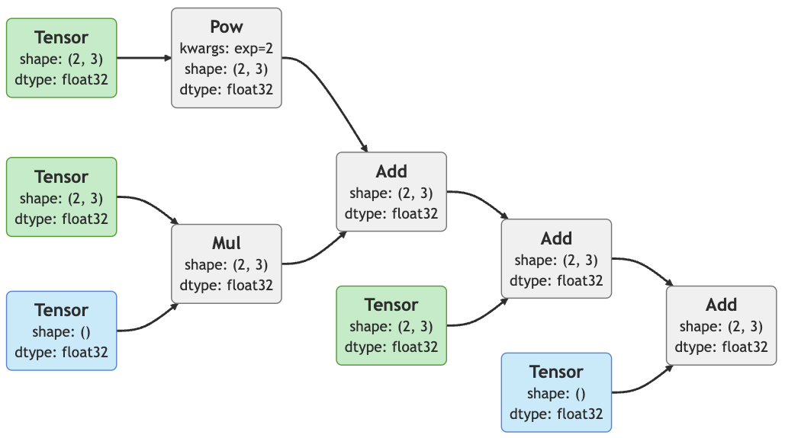
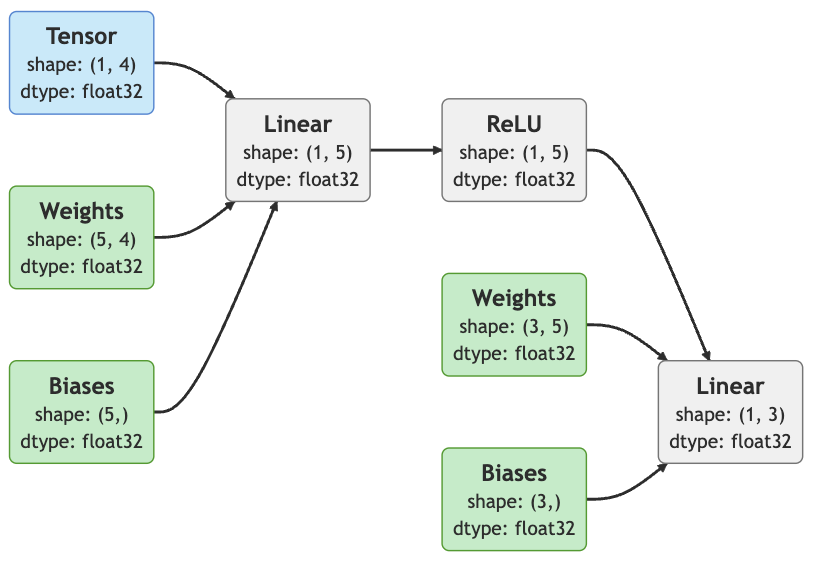

# AutoCompyute

AutoCompyute is a lightweight deep learning library that provides automatic differentiation using only NumPy as the backend for computation (CuPy can be used as a drop-in replacement for NumPy). It is designed for simplicity and performance and enables you to train deep learning models with minimal dependencies while leveraging GPU acceleration. The package supports:

- Tensor operations with gradient tracking.
- Neural network layers and loss functions.
- Performant computation for both CPU and GPU.
- A focus on clarity and simplicity.

## Under The Hood

At its core, AutoCompyute features a `Tensor` object for storing data and gradients, and `Op` objects for defining differentiable operations.

### Tensor Object

The `Tensor` object is the fundamental data structure in this autograd engine. It holds numerical data as a NumPy array and remembers, how it was created by keeping a reference to the `Op` that created it.

**Most Important Attributes:**
- `data`: A NumPy array containing the numerical values.
- `grad`: A NumPy array holding the computed gradients (initialized as `None`, filled by calling `backward()`).
- `ctx`: Stores a reference to the operation (`Op`) that created this tensor.
- `src`: References the parent tensors involved in the creation of the tensor.

### Op Object

The `Op` object represents a differentiable operation applied to tensors. Each operation implements both a forward and backward pass.

### How the Engine Works

1. **Computation Graph Construction**: When an operation (e.g., `Tensor.add`) is called, an `Op` instance is created. It performs the forward computation while also caching intermediate values that are required for the backward pass. The resulting output tensor maintains references to the `Op` and parent tensors, forming a computational graph.

2. **Backpropagation**: Calling `backward()` on the final tensor (e.g. a loss value) initiates gradient computation. The gradients propagate in reverse through the computational graph by calling `backward()` on each `Op`, which distributes gradients to parent tensors.

3. **Gradient Storage**: As the gradients are propagated, they are stored in the `grad` attribute of each `Tensor`, enabling later parameter updates for optimization.

## Installation

1. Clone or download the repo

2. pip-install it

CPU:
```bash
pip install .
```

GPU (uses CuPy, make sure to install the CUDA libraries beforehand, see the [CuPy docs](https://docs.cupy.dev/en/stable/install.html)):
```bash
pip install .[cuda]
```

## Usage

AutoCompyute closely follows the PyTorch syntax.

You can create a tensor from raw data or use a factory function to fill a tensor with data. Setting the tensor to require gradients (`req_grads=True`) signals, that it should be part of a computational graph for backpropagation.


```Python
import auto_compyute as ac

# randn creates a tensor with values drawn from a standard normal distribution.
x1 = ac.randn(2, 3, req_grad=True)  # shape (2, 3)
x2 = ac.randn(2, 3, req_grad=True)  # shape (2, 3)
x3 = ac.randn(2, 3, req_grad=True)  # shape (2, 3)

y = x1 ** 2 + 4 * x2 + x3 + 10
y
```
```bash
Tensor([[13.8923, 11.5502,  5.2445],
        [15.6469, 18.8092, 16.2810]], dtype=float32, device=cpu, grad_fn=Add)
```

The computational graph can also be visualized using the `mermaid-python` package.

```Python
ac.autograd.draw_graph(y)
```


By defining a bunch of `Ops` this forms a basic framework, that allows you to build and train most machine learning models easily.

AutoCompyute also offers a module base class for holding the state of a neural network layer (parameters, buffers, etc.). To create your own modules, simply inherit from the `auto_compyute.nn.Module` base class, make sure to call `super().__init__()` in your init method and implement a `forward()` method. The rest is up to you.

```Python
from auto_compyute import nn
import auto_compyute.nn.functional as F

class MyModule(nn.Module):  # inherit from Module
    def __init__(self):
        super().__init__()  # call parent init
        self.lin1 = nn.Linear(in_dim=4, out_dim=5)
        self.lin2 = nn.Linear(in_dim=5, out_dim=3)

    def forward(self, x):  # implement a forward method
        x = self.lin1(x)
        x = F.relu(x)
        x = self.lin2(x)
        return x

module = MyModule()
x = ac.randn(1, 4)
y = module(x)  # modules are callable

ac.autograd.draw_graph(y) # the constructed graph can be visualized
```


And that's all you need to build all sorts of models.

## Examples
see [Examples](https://github.com/dakofler/auto_compyute/tree/main/examples)

## Author
Daniel Kofler - ([dkofler@outlook.com](mailto:dkofler@outlook.com))

## License
[MIT](https://choosealicense.com/licenses/mit/)

## Final Notes
This project is an extension of my previously developed library [Compyute](https://github.com/dakofler/compyute) which did not feature automatic differentiation. This made it hard and time consuming to implement new models. I use this new project to dive deeper into the idea of autograd and learn as I go. The code is therefore by far not perfect. If you have any suggestions or find any bugs, please don't hesitate to contact me.

Cheers,<br>
Daniel